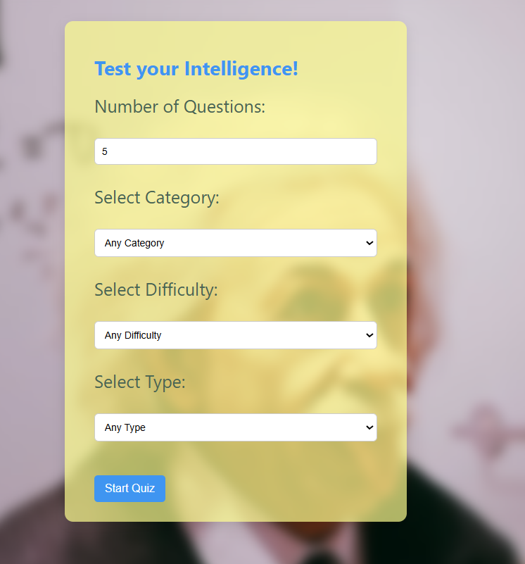
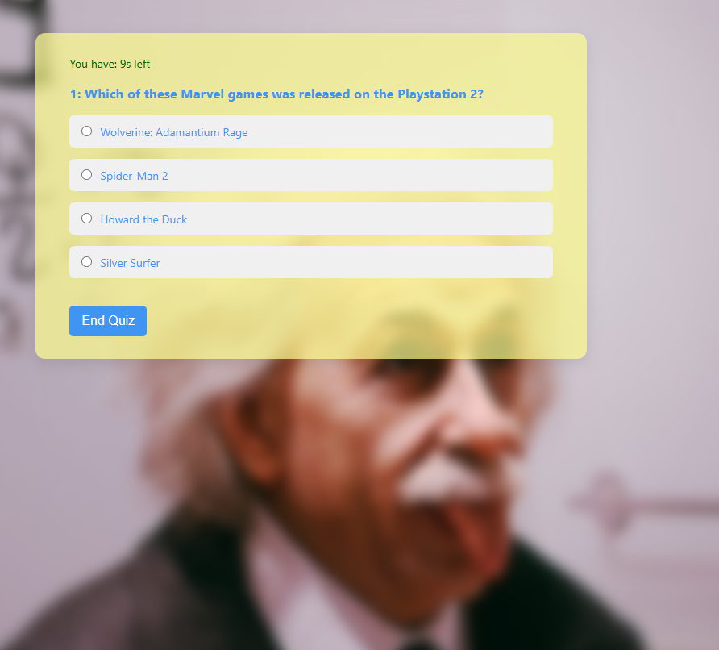
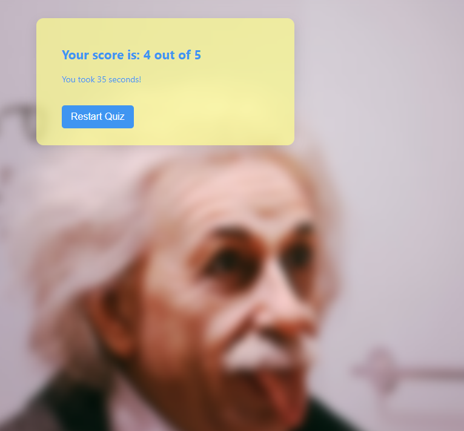
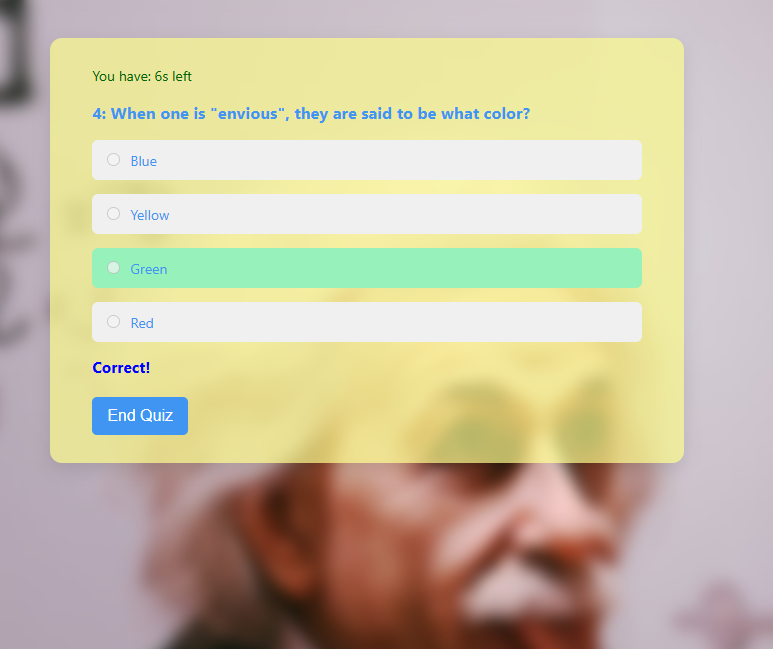
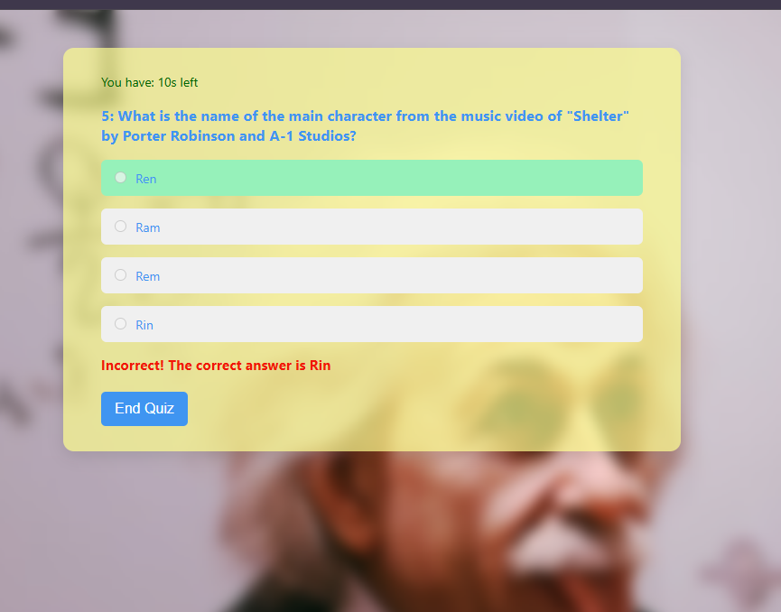
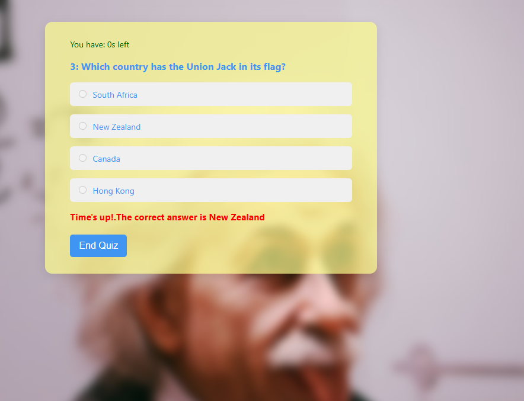
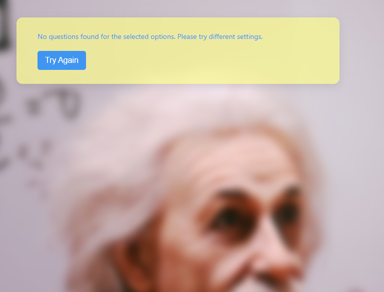

# Trivia Application

## Overview

This is a simple trivia application built using HTML, CSS, and JavaScript.
The application fetches quiz questions from the Open Trivia Database API
based on user-selected criteria (number of questions, category, difficulty,
and type). It dynamically displays questions, tracks user scores, and provides feedback on answer selection.

## Features

-   **Dynamic Question Loading:** Fetches quiz questions from the Open Trivia Database API.
-   **Customizable Quizzes:** Allows users to specify the number of questions, category, difficulty, and type of quiz.
-   **Real-time Feedback:** Provides immediate feedback on whether the selected answer is correct or incorrect.
-   **Scoring:** Tracks the user's score throughout the quiz.
-   **Timer:** Limits the time for each question.
-   **Responsive Design:** Adapts to different screen sizes for optimal user
    experience.
-   **Error Handling:** Displays user-friendly error messages if there are
    issues loading the quiz questions.

## Technologies Used

-   HTML
-   CSS
-   JavaScript

## Setup

1.  Clone the repository:

    ```bash
    git clone git@github.com:Moringa-SDF-PT10/valentine-wanjiru-trivia-project.git
    ```
2. Navigate into the repo you just cloned.

    ```bash
    cd valentine-wanjiru-trivia-project
    ```

## Usage

1.  Open the `index.html` file in your web browser.
2.  On the start page, use the form to select your quiz criteria:
    -   **Number of Questions:** Choose the number of questions for the quiz.
    -   **Category:** Select a category for the quiz questions.
    -   **Difficulty:** Choose the difficulty level (easy, medium, hard).
    -   **Type:** Select the question type (multiple choice, true/false).
3.  Click the "Start" button to begin the quiz.
4.  Answer each question by selecting one of the provided options.
5.  After answering a question, you will receive immediate feedback. The quiz will automatically advance to the next question after a brief delay.
6.  If you run out of time on a question, the quiz will automatically advance to the next question.
7.  Once all questions have been answered, or if you choose to end the quiz
early, your score will be displayed, along with the time taken to complete the quiz.
8.  You can restart the quiz by clicking the "Restart Quiz" button.

## JavaScript Code Overview

The main JavaScript file (`script.js`) handles the following:

-   Fetching quiz questions from the Open Trivia Database API based on user
    selections.
-   Dynamically generating and displaying quiz questions and answer options.
-   Handling user answer selections and providing feedback.
-   Tracking the user's score and displaying the final results.
-   Managing the quiz timer and handling time-out scenarios.
-   Displaying error messages if there are issues loading the quiz questions.

 ## Screenshots
- Start page

- Quiz in progress

- Results page
 
- When a correct answer is picked
 
- When an incorrect answer is picked
 
- When the timer for each question runs out
 
- Error when there are no questions for the selected options
